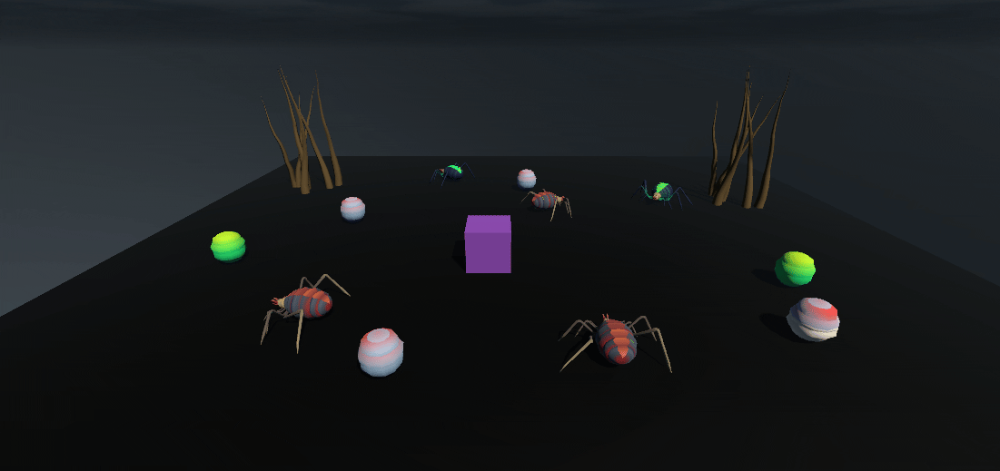
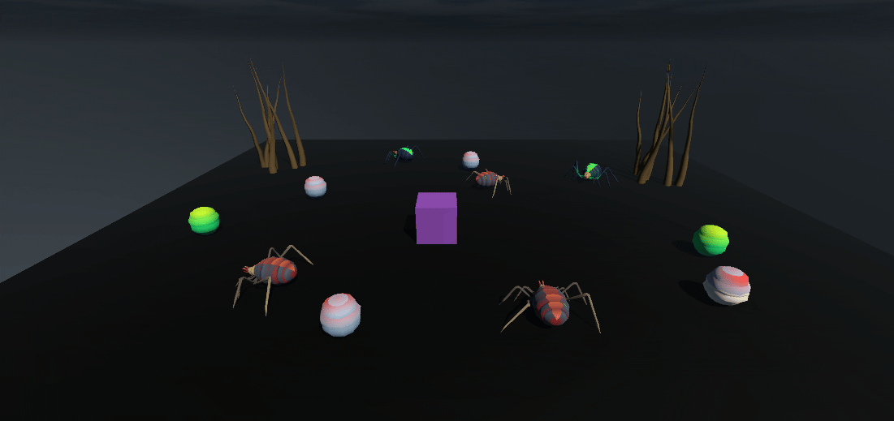
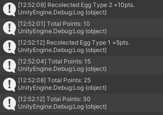
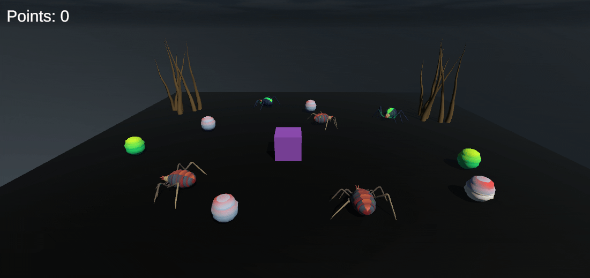

# Interfaces Inteligentes P04
## Ejercicio 1

#### El **cubo** tiene un script para que el usuario lo pueda mover llamado `Move.cs`. Utiliza los mismos conceptos que la práctiva anterior

***Nota:*** El cubo es un objeto físico (contiene `Rigidbody` y `Collider`)

```cs
    void Start()
    {
        rb = GetComponent<Rigidbody>();
    }
```

```cs
    void FixedUpdate()
    {
        float horizontal = Input.GetAxis("Horizontal");
        float vertical = Input.GetAxis("Vertical");

        Vector3 direction = new Vector3(horizontal, 0, vertical);
        
        if (direction.magnitude > 0)
        {
            direction.Normalize();

            Quaternion rotation = Quaternion.LookRotation(direction);
            rb.MoveRotation(Quaternion.Slerp(rb.rotation, rotation, rotationSpeed * Time.fixedDeltaTime));

            rb.MovePosition(rb.position + direction * speed * Time.fixedDeltaTime);
        }
    }
```

#### El **cilindro** contiene el script `CyllinderCollider.cs`. El cual utiliza el `patrón obervador`
* El **Patrón Obervador funciona de la siguiente manera**:
  
  1. Se define el delegado y evento
     
    * El **delegado** actua como la estructura para los métodos que reaccionarán ante ciertos eventos. En este caso, el delegado `CubeCollidedWithSphere` representará los métodos cuando el cubo colisione con el cilindro.
    * El **evento estático de tipo de delegado** es declarado para que cualquier clase pueda suscribirse a este evento
      
  2. Cuando ocurre una colisión (en este caso entre el cubo y el cilindro), se invoca al evento, notificando a todos los suscriptores que ha ocurrido la colisión
  3. Otras clases se suscriben al evento con `+=` en `OnEnable()` y desuscriben con `-=` en `OnDisable()`. Así las esferas escuchan el evento y reaccionan cuando ocurra
  4. Cuando el evento se dispara, los suscriptores (en este caso las esferas) reaccionan ejecutándo un método

```cs
public class CollisionNotifier : MonoBehaviour
{
    public delegate void CubeCollidedWithSphere();
    public static event CubeCollidedWithSphere OnCubeCollisionWithSphere;
    private void OnCollisionEnter(Collision collision)
    {
        if (collision.gameObject.CompareTag("Cube"))
        {
            OnCubeCollisionWithSphere?.Invoke();
        }
    } 
}
```
#### Las esferas de tipo 1 y tipo 2 tienen sus controladores `Spherecontroller1.cs` y `SphereController2.cs` respectivamente

***Nota:*** Ambos scripts son iguales exeptuando el nombre de la función que llama a `MoveTowards` y el nombre del objeto al que se dirigen

```cs
    public Transform target;
    private GoTowards goTowards;
```
```cs
    void Start()
    {
        goTowards = GetComponent<GoTowards>();
    }
```

Aquí simplemente creamos los atribudos para establecer el objetivo (`target`) y el `GoTowards`. En el Start() se recupera ese componente, el cual es otro script

```cs
    void OnEnable()
    {
        CyllinderCollider.OnCubeCollisionWithSphere += GoToSphere;
    }

    void OnDisable()
    {
        CyllinderCollider.OnCubeCollisionWithSphere -= GoToSphere;
    }
```

Esto es para el `el paso 3` del **patrón obervador**, la suscripción

```cs
    void GoToSphere()
    {
        if (goTowards != null && target != null)
        {
            goTowards.SetTarget(target);
        }
    }
```

Se etsablece el `target` para que las esferas sepan hacian dónde moverse

#### Todas las esferas contienen el script `MoveTowards`, que simplemente aplica la lógica de movimeinto

```cs
    void Start()
    {
        rb = GetComponent<Rigidbody>();
        target = null;
    }
```
El target se declara `null` al principio para que las esferas no se muevan hasta que el cubo collisione al cilindro y desde el controlador de llame a `SetTarget`

```cs
    void FixedUpdate()
    {
        if (target != null && rb != null)
        {
            Vector3 direction = target.position - transform.position;
            rb.MovePosition(transform.position + direction.normalized * speed * Time.fixedDeltaTime);
        }
    }
```
Mueve el objeto hacia un objetivo calculando la dirección y actualizando su posición en cada frame fijo usando físicas

```cs
    public void SetTarget(Transform newTarget)
    {
        target = newTarget;
    }

    public Transform GetTarget()
    {
        return target;
    }
```
También incluye un `setter` y un `getter`


## Ejercicio 2
Ahora tenemos una escena con `arañas` y `huevos`
- Las `arañas verdes` son de **tipo 1** (equivalente a esferas de tipo 1)
- Las `arañas rojas` son de **tipo 2** (equivalente a esferas de tipo 2)
- Los `huevos verdes` son de **tipo 1** (a la que se acercan equivale al cilindro)
- Los `arañas rojos` son de **tipo 2**


## Ejercicio 3
* **Cubo** colisiona con **Araña Tipo 2 (Roja)** -> **Araña Tipo 1 (Verde)** se dirige hacia el **Cofre del Tesoro**

Para detectar que el cubo ha colisionado contra la araña del tipo dos, se urará el patrón obervador. E lscript del notificador irá en la araña de tipo 2.

```cs
public enum SpiderType
{
    Type1,
    Type2
}
```
Aquí definimos los tipos de arañas que pueden haber y se asigna en el inspector.

```cs
public class CollisionNotifier : MonoBehaviour
{
    public delegate void CubeCollidedWithSpider(SpiderType spiderType);
    public static event CubeCollidedWithSpider OnCubeCollisionWithSpider;
    public SpiderType spiderType;
    private void OnCollisionEnter(Collision collision)
    {
        if (collision.gameObject.CompareTag("Cube"))
        {
            OnCubeCollisionWithSpider?.Invoke(spiderType);
        }
    } 
}
```
El notificador es igual al anterior, simplemente se añade como parámetro el tipo de la araña para que el controlador de las `arañas de tipo 1` sepan hacia dónde dirigirse.

El controlador de las arañas de tipo 1 también se suscriben y desuscriben al evento como se indicó antes. Veamos las funciones propias de este controlador:

```cs
CollisionNotifier.OnCubeCollisionWithSpider += HandleCubeCollisionWithSpider;
```

```cs
    void HandleCubeCollisionWithSpider(SpiderType spiderType)
    {
        if (spiderType == SpiderType.Type1)
        {
            MoveTowardsNearestType2Egg();
        }
        else if (spiderType == SpiderType.Type2)
        {
            MoveTowardsSelectedObject();
        }
    }
```

Dependiendo del tipo de araña con el que ha colisionado el cubo, llamará a una función u otra.
```cs
    void MoveTowardsSelectedObject()
    {
        if (goTowards != null && selectedObject != null)
        {
            goTowards.SetTarget(selectedObject);
        }
    }
```

* **Cubo** colisiona con **Araña Tipo 1** -> **Araña Tipo 1** se dirige hacia el **Huevo Tipo 2** más cercano
* 
```cs
    void MoveTowardsNearestType2Egg()
    {
        Transform nearestEgg = FindNearestEggOfType2();
        if (goTowards != null && nearestEgg != null)
        {
            goTowards.SetTarget(nearestEgg);
        }
    }
```
* **Araña Tipo 1** cambia de color al colisionar con **Huevo Tipo 2**
  
```cs
    void OnCollisionEnter(Collision collision)
    {
     // . . .    
        if (collision.gameObject.tag == "EggType2" && spiderRenderer != null)
        {
            Color randomColor = new Color(Random.value, Random.value, Random.value, 1.0f);
            spiderRenderer.material.color = randomColor;

            spiderRenderer.enabled = false;
            spiderRenderer.enabled = true;
        }
    }
```
AL detectar una colisión con un huevo de tipo 2, cambia el color del objeto a uno aleatorio y luego desactiva y reactiva el renderizador para forzar la actualización visual


## Ejercicio 4
Se han añadido dos `árboles` a la escena. El árbol de la derecha será el de referencia y el de la izquierda al que se teletransportarán las arañas de tipo 1 y orientarán las arañas de tipo 2.
* **Detector de proximidad**
```cs
    public delegate void OnProximityEvent();
    public static event OnProximityEvent OnProximity;
```
```cs
    void Update()
    {
        float distance = Vector3.Distance(transform.position, referenceObj.position);

        if (distance < distanceThreshold && !hasTeleported)
        {
            if (OnProximity != null)
            {
                OnProximity?.Invoke();
                hasTeleported = true;
            }
        }
        if (distance >= distanceThreshold)
        {
            ResetTeleport();
        }
    }
```
Esta vez se llama en el update, comprobando en cada frame la distancia hasta el objetivo.

La variable `hasTeleported` simplemente indica que si se ha entrado en esa proximidad, que las arañas solo se teletransporten 1 vez. Solo vuelven a teletransportarse si se sale y vuelve a entrar

* **Arañas de Tipo 1**

En el controlador que ya tenían, ahora se suscriben a:
```cs
ProximityDetector.OnProximity += TeleportToObj;
```

Y se cambia su posición al objeto seleccionado
```cs
    void TeleportToObj()
    {
        if (teleportObj != null)
        {
            rb.MovePosition(teleportObj.position);
        }
    }
```

## Ejercicio 5
Primero tendremos un objeto vacío `Points Manager`, que manejará el recuento de puntos
***Nota:*** Se usará el patrón `Singleton`: Este asegura que una clase tenga una única instancia en todo el programa y que se pueda acceder a esa instancia globalmente.
1. Se define la variable estática
```cs
public static PointsManager instance;
```

2. Se inicializa la instancia en `Awake()`. Este método se ejecuta antes de cualquier otro, justo cuando se inicializa el objeto.
   * Si `instance` es null: es la primera vez que se crea un objeto `PointsManager`, por lo que se asigna `this` (instancia actual del objeto) a la variable estática `inctance`. Así la variable estática ahora contiene una referencia a esta instancia.
   * Si ya existe una instancia y la nueva creada no es la misma, se destruye el objeto duplicado. Esto asegura que solo haya una instancia en la escena.
   * La función `DontDestroyOnLoad` evita que el objeto que contiene el script se destruya al cargar una nueva escena. Esto sirve para mantener la misma instancia del `PointsManager` durante todo el juego.
  
```cs
    void Awake()
    {
        if (instance == null)
        {
            instance = this;
        }
        else if (instance != this)
        {
            Destroy(gameObject);
        }
        DontDestroyOnLoad(gameObject);
    }
```
* **Métodos de PointsManager**
  * `AddPoints`: Suma los puntos
  ```cs
     public void AddPoints(int pointsToAdd)
    {
        points += pointsToAdd;
        Debug.Log("Total Points: " + points);
    }
  ```
  * `GetPoints`: Getter de los puntos

Después tenemos la clase `Egg`, que contendrán todos los huevos.

```cs
    public void Collect()
    {
        PointsManager.instance.AddPoints(points);
        Destroy(gameObject);
        SpawnNewEgg();
    }
```

Este método es lo que permite sumar la cantidad de puntos adecuada dependiendo del tipo de huevo. Se le asigna los puntos desde el inspector cuando el `cubo` colisiona con el `huevo` (se llama a `OnTriggerEnter` desde otro script wue contiene el cubo). Luego se destruye ese mismo huevo, indicando que ya se ha recogido y luego se crea un huevo nuevo en el mapa con la siguiente función:

```cs
    void SpawnNewEgg()
    {
        GameObject plane = GameObject.Find("Plane");
        Vector3 planeSize = plane.GetComponent<Renderer>().bounds.size;
        Vector3 planePosition = plane.transform.position;

        Camera mainCamera = Camera.main;

        Vector3 spawnPosition = Vector3.zero;
        bool isPositionValid = false;
        
        while (!isPositionValid)
        {
            spawnPosition = new Vector3(Random.Range(planePosition.x - planeSize.x / 2, planePosition.x + planeSize.x / 2),
                                        Random.Range(planePosition.y - planeSize.y / 2, planePosition.y + planeSize.y / 2),
                                        Random.Range(planePosition.z - planeSize.z / 2, planePosition.z + planeSize.z / 2));
            Vector3 screenPoint = mainCamera.WorldToScreenPoint(spawnPosition);
            if (screenPoint.x >= 0 && screenPoint.x <= Screen.width && screenPoint.y >= 0 && screenPoint.y <= Screen.height)
            {
                isPositionValid = true;
            }
        }
        Instantiate(eggPrefab, spawnPosition, Quaternion.identity);
    }
}
```

1. Primero se obtiene el tamaño y la posición del plano
2. Se obtiene la referencia de la cámara principal (esto será para que no se generen huevos donde no se puedan ver)
3. Dentro del bucle se genera una posición válida.
   * El rango para cada eje se calcula a partir de la posición central del plano y su tamaño
   * Se convierte `spawnPosition` a `coordenadas de pantalla` (pasa de posición 3D a 2D de pantalla)
   * Se verifica si la posición generada es visible
4. Se instancia el nuevo huevo

Por último tendremos la clase `RecolectEgg`, que también usará el patrón `Singleton`

```cs
public static RecolectEgg instance;
```

```cs
    void OnTriggerEnter(Collider other)
    {
        Egg egg = other.GetComponent<Egg>();
        if (egg != null)
        {
            if (other.CompareTag("EggType1"))
            {
                Debug.Log("Recolected Egg Type 1 + " + egg.points);
            }
            else if (other.CompareTag("EggType2"))
            {
                Debug.Log("Recolected Egg Type 2 + " + egg.points);
            }
            egg.Collect();
        }
    }
```
Simplemente coge el componente `Egg` del obejto, comprueba con qué tipo de huevo ha chocado para imprimirlo por consola y se recolecta el propio huevo




## Ejercicio 6
Para esto primero se deberá crear un `Canva` y como hijo un `Text (TextMeshPro)`. Se ajusta el texto a lo que sería la pantalla.

Ahora, en `RecolectEgg` se añade esta función y se llama al final del `OnTriggerEnter`, justo después de `egg.Collect()`
```cs
public TextMeshProUGUI pointsText;
```
```cs
    void UpdatePointsUI()
    {
        pointsText.text = "Points: " + PointsManager.instance.GetPoints().ToString();
    }
```


## Ejercicio 7
Primero, en el `Canva`, se creará otro hijo de tipo `Text` llamado `Reward Text` y como antes, se ajusta a la pantalla. 

En `PointsManager`, mientras se añade puntos se hace una comprobación:
```cs
private int pointsForNextReward = 100;
```
```cs
    public void AddPoints(int pointsToAdd)
    {
        // Lógica para sumar puntos
        if (points >= pointsForNextReward)
        {
            GiveReward();
            pointsForNextReward += 100;
        }
    }
```
Si la puntuación es mayor o igual a 100 (la primera vez), se le da una recompensa al usuario. La siguiente recompensa será a los 200 puntos. Y así sucesivamente.

```cs
    void GiveReward()
    {
        Debug.Log("Reward!");
        RecolectEgg.instance.ShowRewardGUI("Reward!");
    }
```

En caso de que existiera la recompensa, su lógica iría aquí.

En `RecolectEgg`, se imprime el mensaje de recompensa por pantalla:
```cs
    public void ShowRewardGUI(string reward)
    {
        rewardText.text = reward;
        rewardText.gameObject.SetActive(true);
        Invoke("HideRewardGUI", 1f);
    }

    void HideRewardGUI()
    {
        rewardText.gameObject.SetActive(false);
    }
```
Tras mostrar el mensaje, se llama a `Invoke` para llamar a otro método con retraso, en este caso se llama a `HideRewardGUI` 1 segundo después de que se llame a `ShowRewardGUI` para que el mensaje se oculte.


## Ejercicio 8
### Se creó un escenario básico con `Blender` y se importó en `Unity`
### Se creó al personaje de primera persona
   1. En un `objeto vacío` se puso un `character controller`
   2. Y como hijos se pusieron una `cámara` (se eliminó la principal) y un `cilindro` que actúa como cuerpo y referencia para las dimensiones del personaje.
   3. Al personaje se le añadió el siguiente scrpit: `PlayerMovement`
   ```cs
    public CharacterController controller;
    public float speed = 7f;

    private Vector3 velocity;
    private float gravity = -9.81f;
    public Transform groundCheck;
    public float groundDistance = 0.4f;
    public LayerMask groundMask;
    private bool isGrounded;
   ```
   * `gravity`: Es negativo para hacer que el jugador "caiga" hacia abajo
   * `groundCheck`: Marca la posición desde la cual el código comprobará si el jugador está tocando el suelo
   * `groundDistance`: Radio de esfera imaginaria que se usa para verificar si el jugador está cerca del suelo
   * `groundMask`: define qué capa se considera suelo
   * `isGrounded`: si el jugador está en el suelo o no
     
   ```cs
    void Update()
    {
        isGrounded = Physics.CheckSphere(groundCheck.position, groundDistance, groundMask);

        if (isGrounded && velocity.y < 0)
        {
            velocity.y = -2f;
        }

        float horizontal = Input.GetAxis("Horizontal");
        float vertical = Input.GetAxis("Vertical");

        Vector3 movement = transform.right * horizontal + transform.forward * vertical;

        controller.Move(movement * speed * Time.deltaTime);

        velocity.y += gravity * Time.deltaTime;
        controller.Move(velocity * Time.deltaTime);
    }
   ```
   1. Se comprueba si el jugador está en el suelo (comprueba si la esfera invisible desde la posición `groundCheck` colisiona con objetos en la capa definida por `groundMask`. Si est así, devuelve true, si no, false;
   2. Si el jugador está en el suelo y su velocidad vertical es negativa (está cayendo), se establece en `-2f` (no es 0 para evitar problemas con la detección del suelo). Asegura que el jugador esté pegado al suelo y no siga cayendo indefinidamente
   3. Se capturan las entradas del jugador y se calcula el movimiento (alineado con la dirección en la que mira el jugador)
   4. Se aplica el movimiento
   5. Se aplica la gravedad. Aumenta la velocidad de caída en cada frame. Cuanto más caiga, más rápido cae (simula la aceleración por gravedad)
      
      $`\text{Nueva velocidad vertical} = \text{Velocidad actual} + (-9.81 \, \text{m/s}^2) \cdot \text{deltaTime}`$
      
Para el movimeinto de la cámara: `MouseLook`
```cs
    public float mouseSensitivity = 100f;
    public Transform playerBody;
    float xRotation = 0f;
```
* `xRotation`: Almacena la rotación acumulada en el eje X
  
```cs
    void Start()
    {
        Cursor.lockState = CursorLockMode.Locked;
    }
```
Bloquea el cursor en el centro de la pantalla, para que el cursor no se mueva fuera de la ventana del juego

```cs
    void Update()
    {
        float MouseX = Input.GetAxis("Mouse X") * mouseSensitivity * Time.deltaTime;
        float MouseY = Input.GetAxis("Mouse Y") * mouseSensitivity * Time.deltaTime;

        xRotation -= MouseY;
        xRotation = Mathf.Clamp(xRotation, -90f, 90f);

        transform.localRotation = Quaternion.Euler(xRotation, 0f, 0f);
        playerBody.Rotate(Vector3.up * MouseX);
    }
```
1. Captura la cantidad de movimiento del rarón en los ejes horizontales y verticales
2. Se ajuste el ángulo de rotación vertical según el movimiento del ratón. Al mover el ratón hacia arriba, `MouseY` es positivo, lo que disminuye la rotación del eje X. Al moverlo hacia abajo ocurre exactamente lo contrario.
3. Se restringe el valor de `XROtation` para evitar que la cámara gire demasiado hacia arriba o hacia abajo, limitando la vista del jugador.
4. Se aplica la rotación a la cámara
5. Se rota el transform del cuerpo del jugador

### Se creó un sistema de recogida de monedas
Esto funciona exactamente igual que el sistema de recogida de puntos con los huevos de las arañas de los ejercicio 5, 6 y 7.

La única diferencia son los nombres de las variables y que las monedas valen 1 punto, es decir, se trata como unidad de moneda.

Cada vez que se le da a jugar, se generan 10 monedas aleatorias a través del mapa:

```cs
void Start()
{
    coinPositions = new List<Vector3>();
    DefineMapLimits();
    GenerateCoins();
}
```
Se definen los límites del amapa y luego se empiezan a generar monedas

```cs
void DefineMapLimits()
{
    BoxCollider boxCollider = map.GetComponent<BoxCollider>();
    superiorLimit = map.transform.position + boxCollider.center + new Vector3(boxCollider.size.x, boxCollider.size.y, boxCollider.size.z) / 2;
    inferiorLimit = map.transform.position + boxCollider.center - new Vector3(boxCollider.size.x, boxCollider.size.y, boxCollider.size.z) / 2;
}
```
El mapa tiene un box collider, así que los límites de calculan sumando y restando la mitad del tamaño del `BoxCOllider`. Esto define los límites donde pueden aparecer las monedas

```cs
void GenerateCoins()
{
    for (int i = 0; i < coinAmount; i++)
    {
        Vector3 randomPosition;
        bool validPosition = false;

        int tries = 0;
        do
        {
            randomPosition = GenerateRandomPosition();
            tries++;

            if (!Physics.CheckSphere(randomPosition, radioCheck, layerMask) && IsValidPos(randomPosition))
            {
                validPosition = true;
            }
            if (tries > 100)
            {
                Debug.Log("No se pudo generar la moneda");
                break;
            }
        } while (!validPosition);

        if (validPosition)
        {
            coinPositions.Add(randomPosition);
            Instantiate(coinPrefab, randomPosition, Quaternion.identity);
        }
    }
}
```
1. El bucle se ejecuta 10 veces para generar cada moneda
2. Se genera una posición aleatoria dentro de los límites del mapa y se verifica si es válida
   1. Para evitar superposiciones con otros objetos, se comprueba si hay algún objeto dentro de `radioCheck` alrededor de la posición generada
   2. También se comprueba se las monedas están lo suficientemente alejadas unas de otras
   3. Si después de más de 100 intentos no se puede generar, se sale del bucle (evita bucles infinitos)
3. Si se encuentra una posición válida, se guarda en la lista y se instancia una moneda

### Enemigo
La intención era que hubiese un enemigo persiguiendo al jugador durante toda la partida, sin embargo, debido a la cantidad de obstáculos, no fue posible. El enemigo siempre intentaba escalar la pared (intentando llegar en línea recta). Mediante el uso del `patrón observador` se aumentaría la velocidad del enemigo a medida que se iban cogiendo más monedas, aumentando la dificultad del juego.

(1).gif)

## Ejercicio 9
El cubo ya era un objeto físico
